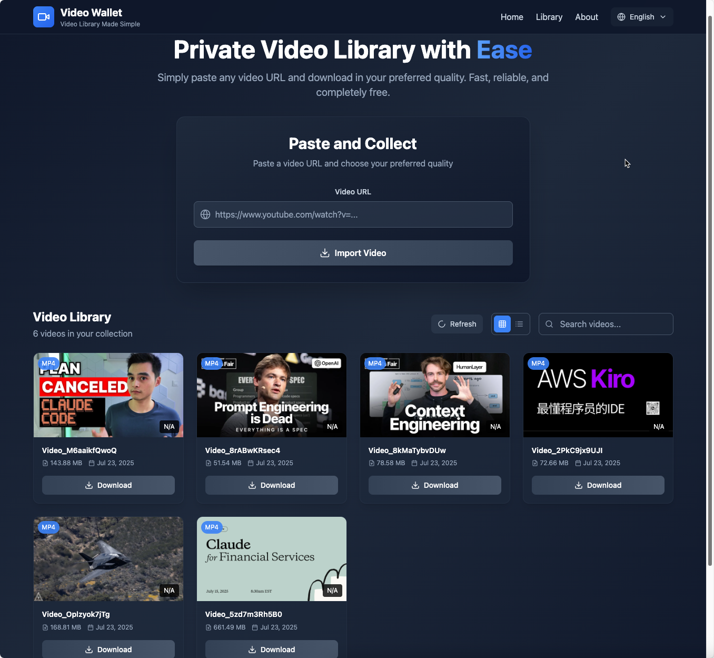

# Video Wallet

English | [中文](./README_CN.md)

Video Wallet is a modern web application for downloading and managing videos from various online platforms, built with React.js, Tailwind CSS, and FastAPI. Uses yt-dlp for video downloading capabilities.



## Project Structure

```
vid-toolkit/
├── src/
│   ├── web/          # React.js frontend with Tailwind CSS and TypeScript
│   └── server/       # FastAPI backend service
├── .vercel/          # Vercel deployment configuration
├── README.md
└── package.json      # Root package.json with convenience scripts
```

## Features

- **Video Page Analysis**: Analyze video URLs to extract available formats and quality options
- **Video Downloading**: Download videos from supported platforms using yt-dlp
- **Video Library**: Manage downloaded videos with metadata and thumbnails
- **Multi-language Support**: English and Chinese language interface
- **Modern UI**: Responsive design with dark theme and smooth animations
- **Video Player**: Built-in video player for local playback

## Prerequisites

- Node.js (v18 or higher)
- Python (v3.8 or higher)
- npm or yarn
- pip
- yt-dlp (installed automatically with backend dependencies)
- FFmpeg (required by yt-dlp for video processing)

## Setup Instructions

### Quick Setup (Recommended)

Use the convenience scripts from the root directory:

1. Install all dependencies:
   ```bash
   npm run setup
   ```

2. Start the frontend:
   ```bash
   npm run dev:web
   ```

3. Start the backend (in a separate terminal):
   ```bash
   npm run dev:server
   ```

### Manual Setup

#### Frontend Setup (React.js + Tailwind + TypeScript)

1. Navigate to the web directory:
   ```bash
   cd src/web
   ```

2. Install dependencies:
   ```bash
   npm install
   ```

3. Start the development server:
   ```bash
   npm run dev
   ```

   The frontend will be available at `http://localhost:6173`

#### Backend Setup (FastAPI)

1. Navigate to the server directory:
   ```bash
   cd src/server
   ```

2. Create a virtual environment (recommended):
   ```bash
   python -m venv venv
   source venv/bin/activate  # On Windows: venv\Scripts\activate
   ```

3. Install dependencies:
   ```bash
   pip install -r requirements.txt
   ```

4. Start the FastAPI server:
   ```bash
   python main.py
   ```

   The API will be available at `http://localhost:6800`
   API documentation: `http://localhost:6800/docs`

## Configuration

### Cookies (Optional)

For accessing certain platforms that require authentication, you can place a `cookies.txt` file in the appropriate location. The backend is configured to look for cookies at `/home/azureuser/source/cookies.txt`. You can modify this path in the `main.py` file if needed.

### Supported Platforms

This application supports video downloading from any platform supported by yt-dlp, including:
- YouTube
- Vimeo
- Dailymotion
- And many more (see [yt-dlp supported sites](https://github.com/yt-dlp/yt-dlp/blob/master/supportedsites.md))

## Usage

1. Start both the frontend and backend servers (see Setup Instructions above)
2. Open your browser and navigate to `http://localhost:6173`
3. Enter a video URL from a supported platform (YouTube, etc.)
4. Click "Analyze" to see available video formats and quality options
5. Select your preferred format and click "Download"
6. Once downloaded, videos will appear in your Video Library
7. Use the Video Library to:
   - Play videos locally
   - Download videos to your device
   - Manage your video collection

## API Endpoints

### Video Analysis and Download
- `POST /videopage_analyze` - Analyze a video URL to extract available formats
- `POST /videopage_download` - Download a specific video format
- `POST /videopage_save` - Save downloaded video to library

### Video Library Management
- `GET /videopage_list` - Get list of all saved videos
- `GET /videopage_file/{video_id}` - Serve video file by ID
- `GET /video_library/{filename}` - Serve video files directly
- `GET /download/{filename}` - Download processed files

## Development

### Frontend Development

The frontend is built with:
- **React.js 18** with TypeScript
- **Tailwind CSS** for styling and responsive design
- **Vite** for build tooling and development server
- **Lucide React** for icons
- **Multi-language support** (English/Chinese)
- **Context API** for state management

### Backend Development

The backend is built with:
- **FastAPI** for the web framework
- **Uvicorn** as the ASGI server
- **yt-dlp** for video downloading and analysis
- **python-multipart** for file uploads
- **python-ffmpeg** for video processing
- **CORS middleware** for cross-origin requests

### Key Features Implemented

- ✅ Video URL analysis with format detection
- ✅ Multi-quality video downloading
- ✅ Thumbnail extraction and management
- ✅ Video library with metadata storage
- ✅ Local video playback
- ✅ Responsive UI with dark theme
- ✅ Multi-language interface
- ✅ File serving and download capabilities

## License

MIT License